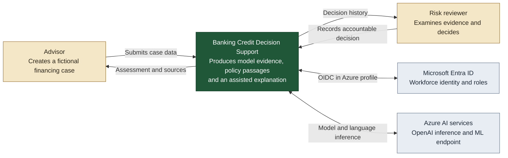

# C4 level 1 — System context

This is the widest view. It deliberately avoids implementation details and shows
the people and managed platforms that interact with the decision-support system.

## Trust boundary

The system treats identity assertions, uploaded policy text, model artifacts and
generated language as separate trust domains. A valid reviewer identity is still
required after the AI steps complete.

