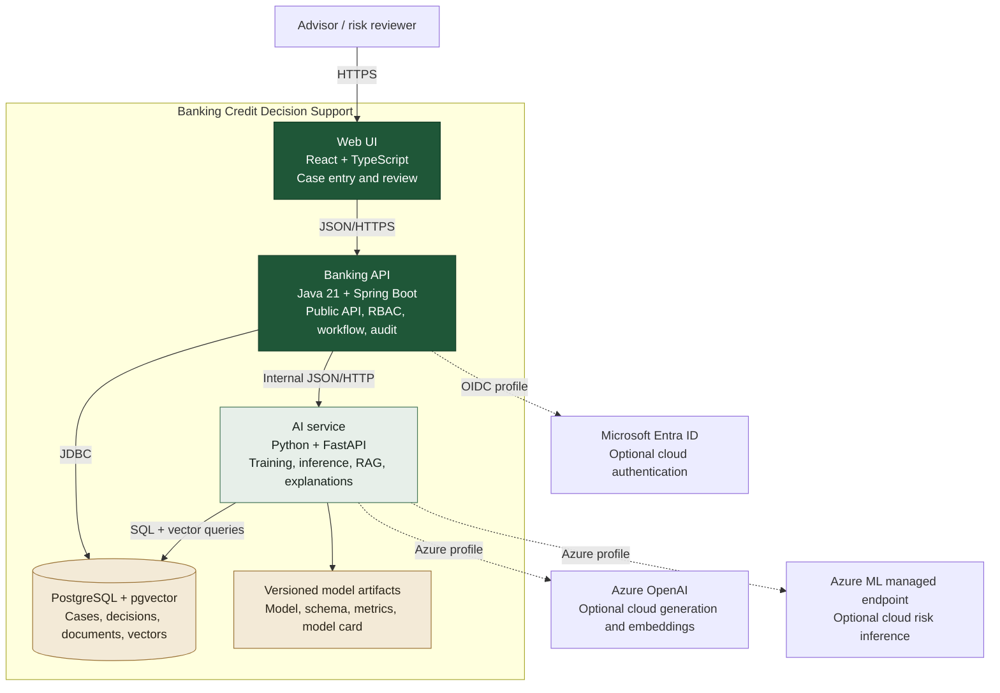

# C4 level 2 — Containers

In C4, a container is an independently running application or data store, not
necessarily a Docker container.

## Dependency rule

The UI only calls the Banking API. The API may degrade when the AI service is
unavailable, but the AI service never becomes a second public business API.

