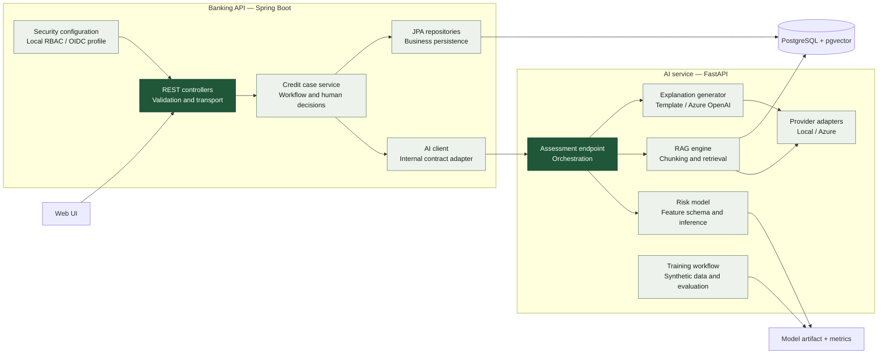

# C4 level 3 — Components

This view zooms into the two backend containers. Arrows show runtime dependency
direction, not package imports.

## Important contracts

- The public API uses versioned `/api/v1` resources.
- The Python API is explicitly internal under `/internal/v1`.
- Every assessment returns model version, generation mode and source citations.
- The persisted decision is separate from the assessment and requires reviewer role.

