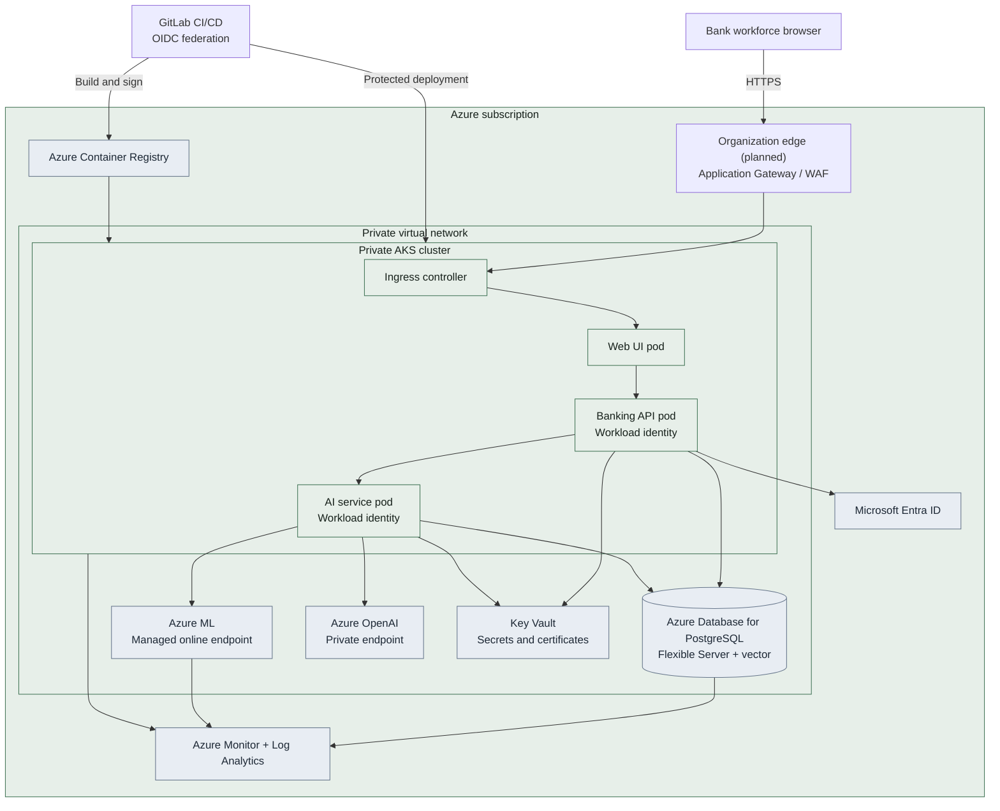

# Azure deployment view

The local runtime uses native processes. This view maps the same logical containers
to a production-oriented Azure topology. Terraform and Kubernetes definitions in
`infrastructure` encode this target; creating it is a manual, cost-bearing action.

## Security posture

- AKS, PostgreSQL, Azure ML and Azure OpenAI use private networking.
- Pods use workload identity instead of embedded service-principal secrets.
- Key Vault CSI supplies only secrets that cannot use identity directly.
- GitLab deploys through workload identity federation and a protected environment.
- The public edge terminates TLS and applies WAF policy; application pods are not
  directly exposed.

The Terraform baseline implements the private platform and service endpoints. The
public edge remains an explicit integration point because certificates, DNS and a
shared ingress topology are organization-specific. The checked-in Kubernetes
ingress therefore uses a non-routable `.invalid` host and is not a claim of a
production-ready internet boundary.
