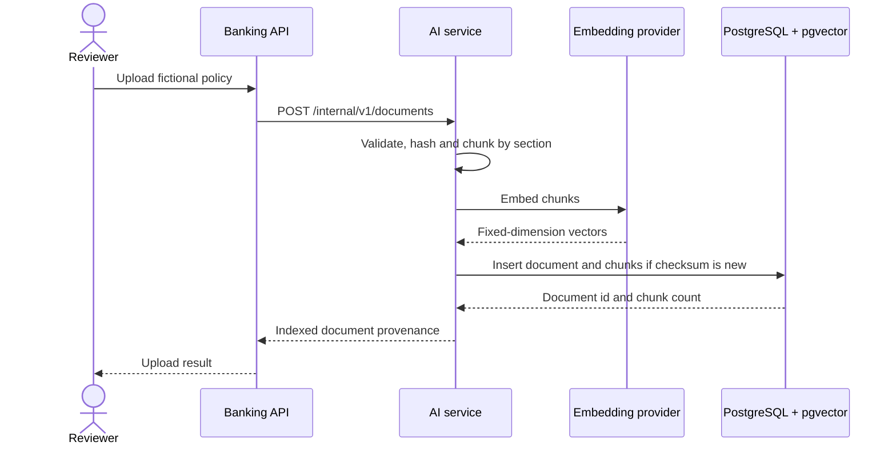
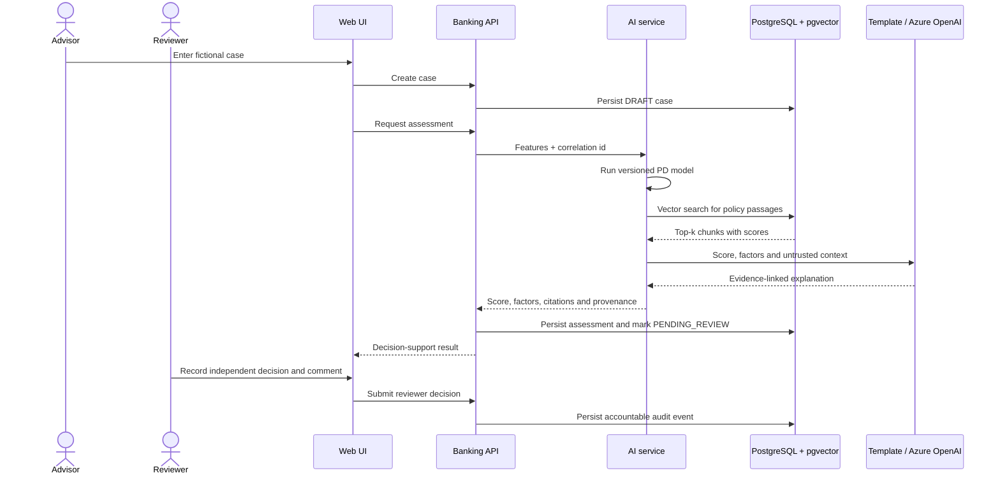

# Runtime sequences

## Policy ingestion

## Assisted assessment and human decision

### Concrete dentist example

For the prepared demo case, the advisor submits the following synthetic values:

| Input | Value |
|---|---:|
| Profession | Dentist |
| Annual income | EUR 185,000 |
| Practice revenue | EUR 620,000 |
| Practice age | 4 years |
| Existing debt | EUR 80,000 |
| Requested credit | EUR 450,000 |
| Equity | EUR 100,000 |
| Recorded late payments | 0 |

The request passes through the sequence above as follows:

1. The Spring Boot API persists the case and sends its features to the internal
   Python service.
2. The selected gradient-boosting artifact derives, among other inputs, a 22.2%
   equity ratio and a 0.43 debt-to-income ratio. The currently checked-in model
   returns about 3.3% probability of default. This value is version-dependent
   and reflects synthetic associations, not a causal explanation.
3. RAG forms a search query from the case, embeds it and uses pgvector to find
   relevant fictional policy chunks, for example the equity-contribution and
   capacity-review sections.
4. The local template, or an Azure OpenAI LLM when configured, receives the
   fixed model result, visible factors and retrieved chunks. It produces a
   source-linked explanation but cannot change the score or approve the case.
5. The API stores the assessment as `PENDING_REVIEW`. A human reviewer inspects
   the inputs and citations and records the final decision with an audit event.
