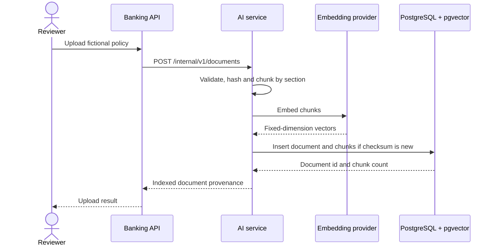
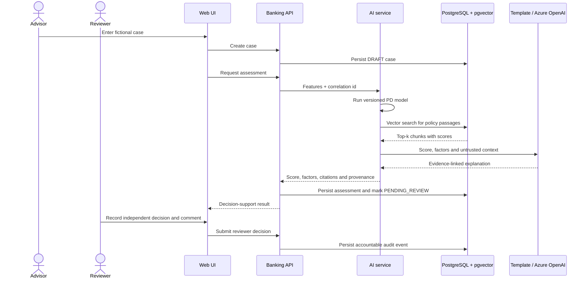

# Runtime sequences

## Policy ingestion

```mermaid
sequenceDiagram
    actor Reviewer
    participant API as Banking API
    participant AI as AI service
    participant Embed as Embedding provider
    participant DB as PostgreSQL + pgvector

    Reviewer->>API: Upload fictional policy
    API->>AI: POST /internal/v1/documents
    AI->>AI: Validate, hash and chunk by section
    AI->>Embed: Embed chunks
    Embed-->>AI: Fixed-dimension vectors
    AI->>DB: Insert document and chunks if checksum is new
    DB-->>AI: Document id and chunk count
    AI-->>API: Indexed document provenance
    API-->>Reviewer: Upload result
```

## Assisted assessment and human decision

```mermaid
sequenceDiagram
    actor Advisor
    actor Reviewer
    participant UI as Web UI
    participant API as Banking API
    participant AI as AI service
    participant DB as PostgreSQL + pgvector
    participant Gen as Template / Azure OpenAI

    Advisor->>UI: Enter fictional case
    UI->>API: Create case
    API->>DB: Persist DRAFT case
    UI->>API: Request assessment
    API->>AI: Features + correlation id
    AI->>AI: Run versioned PD model
    AI->>DB: Vector search for policy passages
    DB-->>AI: Top-k chunks with scores
    AI->>Gen: Score, factors and untrusted context
    Gen-->>AI: Evidence-linked explanation
    AI-->>API: Score, factors, citations and provenance
    API->>DB: Persist assessment and mark PENDING_REVIEW
    API-->>UI: Decision-support result
    Reviewer->>UI: Record independent decision and comment
    UI->>API: Submit reviewer decision
    API->>DB: Persist accountable audit event
```

