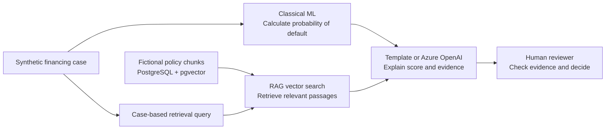

# Architecture documentation

## What is C4?

C4 explains software architecture by zooming in, similar to an online map:

1. **System context** shows people and external systems around the product.
2. **Containers** shows the independently running applications and data stores.
3. **Components** shows the main responsibilities inside those applications.
4. **Code** can show individual classes, but is intentionally omitted here because
   code diagrams become stale quickly and the source is clearer at that level.

This documentation adds a deployment view for the Azure runtime. All diagrams use
standard Mermaid flowcharts inside Markdown, so GitHub renders them directly in the
repository without a documentation server or exported image.

## Views

| View | Question answered |
|---|---|
| [1. System context](01-system-context.md) | Who uses the system and what surrounds it? |
| [2. Containers](02-containers.md) | Which applications and stores run? |
| [3. Components](03-components.md) | How is an assessment implemented? |
| [4. Azure deployment](04-azure-deployment.md) | Where do those parts run in Azure? |
| [5. Runtime sequences](05-runtime-sequences.md) | What happens during ingestion and assessment? |

## Principles

- Spring Boot owns the public API, authorization, workflow and audit trail.
- Python owns model and retrieval concerns behind an internal interface.
- Generated text is evidence-linked assistance, never an autonomous decision.
- The local and Azure provider profiles share the same business contracts.
- Secrets enter through local ignored overrides or managed Azure identities.

## AI and ML responsibility flow

The architecture keeps prediction, retrieval, explanation and accountability as
separate steps. This prevents a fluent generated answer from being mistaken for
either a model calculation or a credit decision.

- **ML** learns associations from deterministic synthetic training examples. It
  compares logistic regression and gradient boosting and returns a versioned
  probability, not a decision.
- **RAG** is retrieval-augmented generation: it does not retrain the ML model or
  decide anything. It finds relevant fictional policy sections by comparing
  embeddings in pgvector and supplies those sections as evidence.
- **Generation** uses a deterministic template locally or, when configured, an
  Azure OpenAI LLM. It writes an understandable explanation from the supplied
  score, factors and retrieved text; it must cite its context and cannot alter
  the calculated probability.
- **Human review** remains the accountable boundary and persists the final
  decision in the Spring Boot workflow and audit trail.

For the prepared dentist example, EUR 100,000 equity on EUR 450,000 requested
credit produces a 22.2% equity ratio, while EUR 80,000 existing debt on
EUR 185,000 annual income produces a 0.43 debt-to-income ratio. The checked-in
model currently estimates about 3.3% probability of default. RAG retrieves the
applicable equity and capacity-review passages, and the generator explains this
combination with citations before a reviewer records an independent outcome.
The detailed request sequence is shown in
[Runtime sequences](05-runtime-sequences.md#concrete-dentist-example).

Architecture decisions are recorded in [`decisions`](decisions/README.md).
